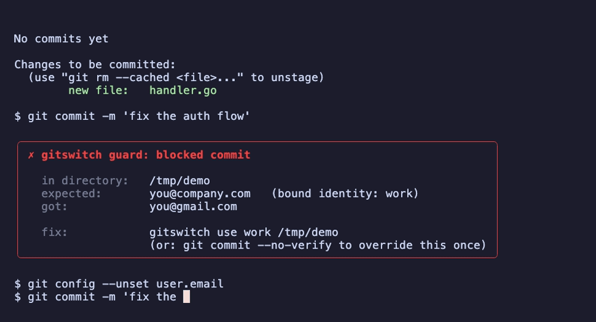

# gitswitch

> **Stop committing as the wrong person.**

<p align="center">
  
</p>

You set your `git user.email` to your work address last Tuesday. You forgot to switch back. For the next two weeks every commit to your personal side project went out under your employer's email. You found out when a friend asked why your green squares moved to a different account.

If that story sounds familiar, you're not careless — you're using the wrong tool. Git has no idea you're two different people depending on which folder you're in. SSH cheerfully sends every key in your agent to every host. The GitHub CLI is logged into a different account than your last `git config`. None of these layers talk to each other, and any of them can silently disagree.

`gitswitch` makes them agree, **and refuses to let you commit when they don't.**

---

## Install

```bash
brew install gitswitch
```

Or, on Linux / Windows, or without Homebrew:

```bash
curl -sL https://gitswitch.dev/install | sh
```

Single binary, no Python, no system dependencies. ~3.8 MB. Works on macOS arm64/x64, Linux x64/arm64, Windows.

## Quickstart — 30 seconds

```bash
# 1. Auto-detect what's already on your machine and propose a setup.
gitswitch init

# 2. Bind an identity to a directory. Switching now happens automatically
#    when you `cd` into the folder.
gitswitch use work     ~/work
gitswitch use personal ~/code

# 3. Install the guard. Refuses commits where the active identity is
#    wrong for the directory you're in. The killer feature.
gitswitch guard install

# 4. Verify everything agrees, end to end.
gitswitch doctor
```

That's it. After this, you don't think about identity again until something tries to go wrong — and then `gitswitch` tells you, before the bad commit happens.

## What it does, with examples

### `gitswitch init` — turn the unknown into the known

Reads your existing `~/.gitconfig`, `~/.ssh/config`, `gh auth status`, ssh-agent, and GPG keyring. Detects every identity that's already on your machine. Proposes a canonical setup. Doesn't touch anything until you say yes.

```
Found 2 identities on this machine:
  • work     ofir@company.com   key: id_ed25519     gh: ofir-work
  • personal ofir474@gmail.com  key: id_rsa         gh: OfirHaim1

Bind to directories?
  ▸ work     → ~/work/
    personal → ~/code/, ~/projects/
```

### `gitswitch use <identity> [<dir>]` — bind, don't switch

Configures `includeIf` in `~/.gitconfig`, a per-account `Host github.com-<name>` alias in `~/.ssh/config` with `IdentitiesOnly yes`, and SSH commit signing — all in one atomic operation. Existing entries are preserved; this is not the kind of tool that nukes your config.

After `gitswitch use`, every `cd` is a switch. No manual step.

### `gitswitch guard install` — the seatbelt

A pre-commit hook that runs in **5 milliseconds**. If the email about to be committed doesn't match the identity bound to the current directory, the commit is refused:

```
$ git commit -m "fix the thing"

✗ gitswitch guard: blocked commit
  in directory:  ~/work/some-repo/
  expected:      ofir@company.com   (bound identity: work)
  got:           ofir474@gmail.com
  fix:           gitswitch use work
                 (or: git commit --no-verify to override this once)
```

The dev.to article *"I used the wrong git email for two weeks and no one noticed"* — `guard` makes that story impossible.

### `gitswitch doctor` — the rear-view mirror

End-to-end identity verification across the layers that have opinions about who you are: `git config`, `~/.ssh/config`, `ssh -T`, `gh api user`, the SSH signing key. One green line if they agree, a red diff if they don't.

```
$ gitswitch doctor
  ✓ git                    OfirHaim1 <ofir474@gmail.com>
  ✓ ssh-config             github.com
  ✓ ssh-auth (github.com)  Hi OfirHaim1!
  ✓ gh                     OfirHaim1
  ✓ all layers agree
```

Run it any time you suspect drift. After every fresh switch. Before a sensitive PR. About 10× a day in practice.

### `gitswitch why` — debug the magic

The honest counterweight to "automatic" tools: tell me, in plain English, *why* my identity is what it is right now.

```
$ cd ~/work/some-repo && gitswitch why
  active identity:  work
  user.email:       ofir@company.com
  resolved by:      includeIf "gitdir:~/work/" matched
  ssh host:         github.com-work
  signing key:      ~/.ssh/id_ed25519_work.pub
  bound:            2026-04-12 by `gitswitch use work ~/work`
```

Magic that you can't inspect is just a bug waiting to happen. `why` makes the magic legible.

---

## Commands

| Command | What it does |
|---|---|
| `gitswitch init` | Auto-detect existing identities, propose a setup |
| `gitswitch use <id> [dir]` | Bind an identity to a directory |
| `gitswitch guard install` | Install the global pre-commit hook |
| `gitswitch doctor` | Verify all layers agree |
| `gitswitch why` | Explain the active identity |
| `gitswitch list` | Show all configured identities |
| `gitswitch switch <id>` | One-shot switch (escape hatch — use `use` for daily flow) |

Run any command with `--help` for the full reference.

---

## Why this exists

I committed to a client's repo as my personal email. For three weeks. Nobody noticed except me, on a Saturday, when I was idly looking at my contribution graph and saw squares in the wrong account.

I was annoyed at myself, then more annoyed when I realized there was no good way to prevent it. There's a great obscure git feature called `includeIf` that fixes the directory problem; nobody documents it well, every blog post about it has a comment from someone who got bitten by the trailing-slash gotcha, and even when you set it up correctly it doesn't help with SSH (which leaks every key in your agent), and it doesn't help with the GitHub CLI (which has its own opinion about who you are), and none of these layers will ever tell you when they silently disagree.

So I built the thing that:
- sets up `includeIf` correctly the first time
- adds per-account SSH host aliases with `IdentitiesOnly yes`
- keeps `gh auth` in lockstep
- defaults to SSH commit signing so verification is automatic
- and **refuses to let you commit when any of the above is wrong for the directory you're in**

That last one is the part I needed three weeks ago.

---

## Philosophy

Git identity should be **infrastructure**, not something you remember.

The tool is small, the binary is single, and the only state on your machine lives in `~/.config/gitswitch/` and the directories *you* tell it to manage. We don't run a service. We don't sync your keys to the cloud. We don't ask for telemetry. The maintainer is one developer who got bitten and built this; the issue tracker responds in days, not weeks; the roadmap is public; the tests pass.

If those things stop being true, the project deserves to lose your stars.

---

## Community

- **Issues & feature requests:** [GitHub Issues](https://github.com/target-ops/gitswitch/issues)
- **Discussions:** [GitHub Discussions](https://github.com/target-ops/gitswitch/discussions)
- **Contributions welcome.** Read [CONTRIBUTING.md](CONTRIBUTING.md) for the small handful of conventions.

---

## License

MIT. See [LICENSE](LICENSE).
